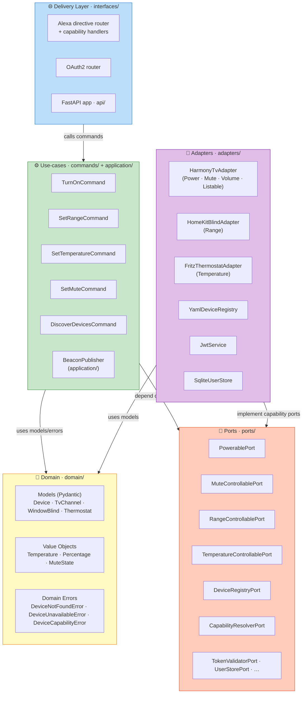

# Hexagonal Architecture

tiberio uses **Hexagonal Architecture** (also called *Ports & Adapters*). This page explains what that means, why it matters, and how it is applied in this codebase — no prior architecture knowledge assumed.

## Why bother with an architecture pattern?

Imagine if `TurnOnCommand` imported `HarmonyService` directly. To test it, you'd need a real Harmony Hub on the network. Every test would be slow, flaky, and dependent on hardware.

With Hexagonal Architecture, the command *never* imports the Harmony library. It only depends on an abstract capability port — `PowerablePort` — and resolves the concrete adapter through a `CapabilityResolverPort`. In tests, the resolver hands back a `MockTvAdapter` that records calls. In production, it hands back `HarmonyTvAdapter`. **The use-case code never changes — only the adapter wired at startup changes.**

## The layers



Note the two use-case locations: `commands/` holds the Alexa device commands (one class per
capability action), and `application/` holds the beacon-publishing use-case
(`BeaconPublisher`), run by the beacon loop in `api/app.py`. A single device adapter
(e.g. `HarmonyTvAdapter`) implements **several** capability ports, and is selected at
runtime by `device.adapter` through a `CapabilityResolverPort` — see
[Wiring with the Container](#wiring-ports-and-adapters-with-the-container) below.

## The one rule you must never break

> **Dependencies only point inward.**

- The domain knows about nothing outside itself.
- Use-cases know only about the domain and the ports — *never* about adapters.
- Adapters know about the domain and their specific library (e.g. `harmonyhub`).
- The delivery layer calls use-cases. It does not call adapters directly.
- `composition.py` is the **only** file that imports both ports and adapters — it exists precisely to wire them together.

Violating this rule means you lose testability, because your business logic becomes entangled with infrastructure.

## Layer-by-layer breakdown

### domain/ — The heart

The domain is pure Python with no I/O and no infrastructure. Models (`domain/models.py`)
and value objects (`domain/values.py`) are **frozen Pydantic `BaseModel`s**:

```python
class Temperature(BaseModel):
    """Target temperature in Celsius (rounded to 0.5-step).

    Range is not validated here; per-device min/max is enforced by the command
    layer using Thermostat.min_celsius / Thermostat.max_celsius.
    """

    model_config = ConfigDict(frozen=True)

    celsius: float

    @classmethod
    def from_float(cls, value: float) -> Temperature:
        return cls(celsius=round(value * 2) / 2)  # round to 0.5-step
```

Value objects enforce the invariants that are universal: `Percentage` rejects values
outside 0–100, for example. Note that `Temperature` deliberately does *not* clamp to a
fixed range — the valid range is device-specific (`Thermostat.min_celsius` /
`max_celsius`) and is checked in `SetTemperatureCommand`. Business rules that are
intrinsic to a value live here; device-specific policy lives in the command layer.

### commands/ — One class per use-case

Each command has a single `execute()` method and depends *only* on ports. Commands
extend a shared `DeviceCommand` base (`commands/_base.py`) that injects a
`DeviceRegistryPort` and a `CapabilityResolverPort`. Instead of receiving one specific
device port, a command *resolves* the adapter for the target device's capability:

```python
class TurnOnCommand(DeviceCommand):
    async def execute(self, endpoint_id: str) -> None:
        device, adapter = self._find_and_resolve(endpoint_id, PowerablePort)
        await adapter.turn_on(device)
```

`_find_and_resolve` (from the base) calls `registry.find_device(endpoint_id)` then
`resolver.resolve(device, capability)`. The actual commands are flat modules in
`commands/`: `turn_on`, `turn_off`, `set_mute`, `set_volume`, `adjust_volume`,
`get_speaker_state`, `set_range`, `adjust_range`, `set_temperature`,
`adjust_temperature`, `discover_devices`, `list_connected_devices`.

Notice: no `import harmonyhub`. No `import homekit`. Just ports. Channel switching,
for instance, is an internal detail of `HarmonyTvAdapter.turn_on()` — the command only
knows about `PowerablePort.turn_on(device)`.

### ports/ — Abstract contracts (Python `Protocol`)

Ports are **capability-shaped**, not device-shaped, and defined with a
`@runtime_checkable` `typing.Protocol` — structural typing, no inheritance required.
Every method is *device-centric*: it takes the `Device` as its first argument, so one
adapter can serve many configured devices.

```python
@runtime_checkable
class PowerablePort(Protocol):
    async def turn_on(self, device: Device) -> None: ...
    async def turn_off(self, device: Device) -> None: ...
```

Any class with these methods satisfies the protocol. `HarmonyTvAdapter` satisfies it in
production; `MockTvAdapter` satisfies it in tests. `@runtime_checkable` is what lets the
`Container` verify, via `isinstance`, that a resolved adapter actually implements the
requested capability.

The real ports are:

- **Device capabilities:** `PowerablePort`, `MuteControllablePort`,
  `VolumeControllablePort`, `RangeControllablePort` (`set_range` / `adjust_range` /
  `get_range`), `TemperatureControllablePort` (`set_temperature` / `get_temperature`),
  `ListablePort` (live backend scan).
- **Infrastructure:** `DeviceRegistryPort` (`get_registry` / `find_device`),
  `CapabilityResolverPort` (`resolve` / `all_implementing`), `BeaconPublisherPort`,
  `TokenValidatorPort`, `TokenIssuerPort`, `UserStorePort`, `AuthCodeStorePort`,
  `PasswordHasherPort`.

There is no `TvPort` / `BlindPort` / `ThermostatPort`; helpers like `ensure_activity`
and `set_channel` are now private methods on `HarmonyTvAdapter`, not a port contract.

### adapters/ — Concrete implementations

Adapters contain all the library-specific code, and a single device adapter typically
implements **several** capability ports. `HarmonyTvAdapter` implements `PowerablePort`,
`MuteControllablePort`, `VolumeControllablePort` and `ListablePort`. It wraps
`harmonyhub.service.HarmonyService`, opening a fresh connection per operation (no
persistent WebSocket):

```python
class HarmonyTvAdapter:
    """Implements PowerablePort, MuteControllablePort, VolumeControllablePort, ListablePort."""

    adapter_name = ADAPTER_HARMONY

    def __init__(self, *, service_factory: Callable[[], Any] | None = None) -> None:
        self._service_factory = service_factory or HarmonyService

    async def ensure_activity(self, activity_name: str) -> None:
        try:
            async with self._service_factory() as service:
                status = await service.client.get_current_activity()
                if status.activity_label != activity_name:
                    await service.client.start_activity(activity_name)
        except HarmonyHubError as exc:
            raise DeviceUnavailableError(str(exc)) from exc  # ← maps to domain error
```

Key responsibility: **translate library exceptions into domain errors.** The command
layer only ever sees `DeviceUnavailableError`, `DeviceCapabilityError` or
`DeviceNotFoundError` — never a `HarmonyHubError` from `harmonyhub`. (In tests, the
optional `service_factory` injects a fake `HarmonyService`, so no hub is needed.)

Beyond the device adapters there are infrastructure adapters: `YamlDeviceRegistry`,
`JwtService` (token issue/validate), `SqliteUserStore`, `AuthCodeStore`,
`BcryptPasswordHasher`, and the beacon publishers `S3BeaconPublisher` /
`MockBeaconPublisher`.

### interfaces/ — Delivery

The delivery layer translates between the outside world (HTTP, JSON) and the
application. The Alexa entry point is `POST /alexa/directive`
(`interfaces/alexa/directive_router.py`, router prefix `/alexa`):

```python
@alexa_router.post("/directive")
async def handle_directive(request: Request) -> JSONResponse:
    raw_body = await request.body()
    # 1. (optional) verify HMAC-SHA256 over X-Tiberio-Timestamp + body (replay protection)
    # 2. extract token from the directive JSON (endpoint/payload scope.token), not a header
    # 3. validate it and require the 'alexa' scope
    # 4. dispatch via AlexaDirectiveRouter.route(body) and return JSONResponse
```

For Alexa traffic the bearer token is **not** read from an `Authorization` header — it
comes from inside the directive JSON (`directive.endpoint.scope.token` or
`directive.payload.scope.token`). When a shared secret is configured, requests must also
carry a timestamped HMAC-SHA256 signature (`X-Tiberio-Timestamp` / `X-Tiberio-Signature`)
for AWS→home replay protection. (`Authorization: Bearer` is used only by non-Alexa
endpoints via `interfaces/http_auth.py`.)

`AlexaDirectiveRouter` maps each `(namespace, name)` pair to a capability handler
(`power`, `speaker`, `thermostat`, `range`, `discovery`). Handlers parse the Alexa JSON,
call the right command, and build the Alexa-shaped response. They are thin translators —
no business logic.

OAuth delivery is a separate FastAPI router (`interfaces/oauth/router.py`, prefix
`/oauth`) implementing the Authorization Code Grant + PKCE: `GET`/`POST /oauth/authorize`
and `POST /oauth/token`. It is fronted by a Lambda Function URL and backed by
`TokenIssuerPort`, `UserStorePort`, `AuthCodeStorePort` and `PasswordHasherPort`, with
request rate limiting applied in `api/app.py`.

## Wiring ports and adapters with the Container

`composition.py` is the composition root, and the heart of it is a small type-keyed
`Container`. Adapters are registered once, keyed both by port type and by
`device.adapter` name (`"harmony"` / `"homekit"` / `"fritz"`):

```python
container = (
    Container()
    .register(DeviceRegistryPort, registry)
    .register(HarmonyTvAdapter, harmony, adapter_name=ADAPTER_HARMONY)
    .register(HomeKitBlindAdapter, homekit, adapter_name=ADAPTER_HOMEKIT)
    .register(FritzThermostatAdapter, fritz, adapter_name=ADAPTER_FRITZ)
    # … token/user/auth-code/password/beacon ports …
)
```

The `Container` itself satisfies `CapabilityResolverPort` structurally. When a command
calls `resolve(device, capability)`, the container looks up the adapter for
`device.adapter`, verifies with `isinstance` (thanks to `@runtime_checkable`) that it
implements the requested capability port, and returns it — raising
`DeviceUnavailableError` if no adapter is registered or `DeviceCapabilityError` if it
lacks the capability. `all_implementing(capability)` returns every adapter that satisfies
a port (used by the live-scan `list_connected_devices` path at `GET /devices/connected`).

This is why adding an adapter requires only one `.register()` call: nothing else needs to
know about it. `_wire_commands_and_router()` then instantiates each command as a singleton
(passing the registry and the container-as-resolver) and assembles the
`AlexaDirectiveRouter`.

## Testability in practice

| Scenario | What gets injected |
|---|---|
| Unit test for `TurnOnCommand` | `MockTvAdapter` resolved via a `Container` (a `YamlDeviceRegistry` over a test devices file supplies the device) |
| Integration test for `/alexa/directive` | `build_test_container(devices_config_path)` — mock device adapters |
| OAuth flow test | `build_oauth_test_container(...)` — mock device adapters **plus** real `JwtService`, `SqliteUserStore`, `AuthCodeStore`, `BcryptPasswordHasher` |
| Production | `build_container(settings)` — all real adapters |

`build_oauth_test_container` is built on top of `build_test_container` and simply
overrides the auth ports. Switching between these scenarios is a single function call in
`composition.py` — no test-double configuration is scattered across test files. (Note
there is no `MockDeviceRegistry`; tests use a real `YamlDeviceRegistry` pointed at a test
config.)

## How to add a new device type

1. **Add the domain model** in `domain/models.py` (a frozen Pydantic `BaseModel`
   subclassing `Device`).
2. **Reuse or add a capability port.** Ports are capability-shaped, so a new device
   usually reuses an existing one (`PowerablePort`, `RangeControllablePort`, …). Add a
   new `@runtime_checkable` `Protocol` in `ports/` only for a genuinely new capability;
   every method takes the `Device` as its first argument.
3. **Write the adapter** in `adapters/new_device_adapter.py`, implementing the relevant
   capability port(s) and mapping its library exceptions to domain errors.
4. **Write (or reuse) the command** as a flat module in `commands/` (e.g.
   `set_range.py`), extending `DeviceCommand` and resolving the adapter via the
   capability port.
5. **Wire delivery** by reusing the matching capability handler in
   `interfaces/alexa/handlers/` (`power.py`, `speaker.py`, `range.py`, `thermostat.py`,
   `discovery.py`); add a new handler plus a dispatch entry in
   `interfaces/alexa/router.py` only for a new Alexa capability.
6. **Register everything** in `composition.py`: one `container.register(...,
   adapter_name=...)` per adapter, plus the command/handler wiring in
   `_wire_commands_and_router()` (handlers are passed positionally to
   `AlexaDirectiveRouter` as `power=`, `speaker=`, `thermostat=`, `range_=`,
   `discovery=`).
7. **Add YAML config** in `config/devices.yaml`.

Adding an adapter that reuses an existing capability touches only the composition root and
config (Open/Closed Principle). The container resolves it by `device.adapter` with no
changes to existing commands or ports.
