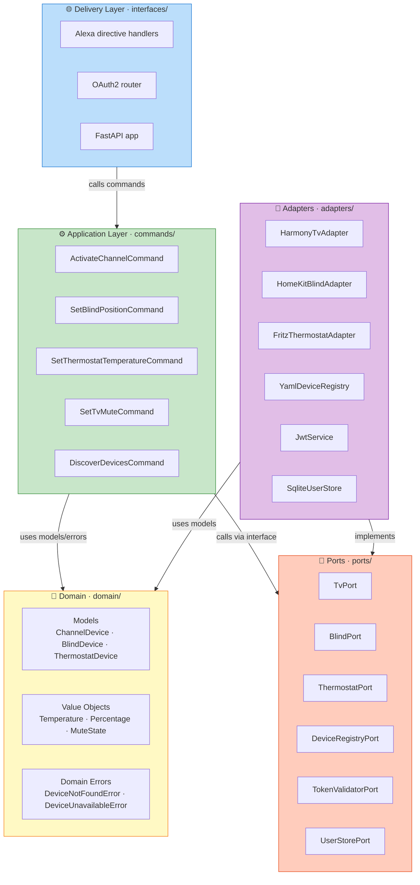

# Hexagonal Architecture

pantau-alexa uses **Hexagonal Architecture** (also called *Ports & Adapters*). This page explains what that means, why it matters, and how it is applied in this codebase — no prior architecture knowledge assumed.

## Why bother with an architecture pattern?

Imagine if `ActivateChannelCommand` imported `HarmonyHubClient` directly. To test it, you'd need a real Harmony Hub on the network. Every test would be slow, flaky, and dependent on hardware.

With Hexagonal Architecture, the command *never* imports the Harmony library. It only calls an abstract `TvPort`. In tests, you inject a `MockTvAdapter` that records calls. In production, you inject `HarmonyTvAdapter`. **The use-case code never changes — only the adapter wired at startup changes.**

## The five layers



## The one rule you must never break

> **Dependencies only point inward.**

- The domain knows about nothing outside itself.
- Use-cases know only about the domain and the ports — *never* about adapters.
- Adapters know about the domain and their specific library (e.g. `harmonyhub`).
- The delivery layer calls use-cases. It does not call adapters directly.
- `composition.py` is the **only** file that imports both ports and adapters — it exists precisely to wire them together.

Violating this rule means you lose testability, because your business logic becomes entangled with infrastructure.

## Layer-by-layer breakdown

### domain/ — The heart

The domain is pure Python: `dataclass` models and value objects, no I/O, no frameworks.

```python
@dataclass(frozen=True, slots=True)
class Temperature:
    celsius: float

    def __post_init__(self) -> None:
        if not (8.0 <= self.celsius <= 28.0):
            raise ValueError(f"Temperature {self.celsius}°C out of range")

    @classmethod
    def from_float(cls, value: float) -> Temperature:
        return cls(celsius=round(value * 2) / 2)  # rounds to 0.5 steps
```

The domain enforces invariants. If a `Temperature` object exists, its value is guaranteed valid. Business rules live here, not scattered across handlers and adapters.

### commands/ — One class per use-case

Each command has a single `execute()` method and depends *only* on ports:

```python
class ActivateChannelCommand:
    def __init__(self, registry: DeviceRegistryPort, tv: TvPort) -> None:
        ...

    async def execute(self, endpoint_id: str) -> None:
        channel = self._registry.find_channel(endpoint_id)
        if channel is None:
            raise DeviceNotFoundError(endpoint_id)
        await self._tv.ensure_activity(registry.tv.watch_activity)
        await self._tv.set_channel(channel.channel_number)
```

Notice: no `import harmonyhub`. No `import homekit`. Just ports.

### ports/ — Abstract contracts (Python `Protocol`)

Ports are defined with `typing.Protocol` — structural typing, no inheritance required:

```python
class TvPort(Protocol):
    async def ensure_activity(self, activity_name: str) -> None: ...
    async def set_channel(self, channel_number: str) -> None: ...
    async def toggle_mute(self) -> None: ...
    async def get_current_activity(self) -> str | None: ...
```

Any class with these methods satisfies the protocol. The `HarmonyTvAdapter` satisfies it in production; `MockTvAdapter` satisfies it in tests.

### adapters/ — Concrete implementations

Adapters contain all the library-specific code. Here is the real TV adapter:

```python
class HarmonyTvAdapter:
    def __init__(self, host: str) -> None:
        self._hub = HarmonyHubClient(host, connection_mode="persistent")

    async def ensure_activity(self, activity_name: str) -> None:
        try:
            status = await self._hub.get_current_activity()
            if status.activity_label != activity_name:
                await self._hub.start_activity(activity_name)
        except (HubUnavailableError, ProtocolError) as exc:
            raise DeviceUnavailableError(str(exc)) from exc  # ← maps to domain error
```

Key responsibility: **translate library exceptions into domain errors.** The command layer only ever sees `DeviceUnavailableError` or `DeviceNotFoundError` — never a `HubUnavailableError` from harmonyhub.

### interfaces/ — Delivery

The delivery layer translates between the outside world (HTTP, JSON) and the application:

```python
@alexa_router.post("/directive")
async def handle_directive(request: Request) -> JSONResponse:
    body = await request.json()
    # 1. validate JWT bearer token
    # 2. call AlexaDirectiveRouter.route(body)
    # 3. return JSONResponse
```

Handlers parse the Alexa JSON, call the right command, and build the Alexa-shaped response. They are thin translators — no business logic.

## Testability in practice

| Scenario | What gets injected |
|---|---|
| Unit test for `ActivateChannelCommand` | `MockTvAdapter` + `MockDeviceRegistry` |
| Integration test for `/alexa/directive` | `build_test_container()` — all mock adapters |
| OAuth flow test | `build_oauth_test_container()` — real `JwtService` + in-memory SQLite |
| Production | `build_container()` — all real adapters |

Switching between these scenarios is a single function call in `composition.py`. No test double configuration is scattered across test files.

## How to add a new device type

1. **Add domain model** in `domain/models.py` (a frozen dataclass).
2. **Define a port** in `ports/new_device_port.py` (a `Protocol`).
3. **Write the command** in `commands/new_device/new_command.py` (depends only on the port).
4. **Write the adapter** in `adapters/new_device_adapter.py` (implements the port).
5. **Write an Alexa handler** in `interfaces/alexa/handlers/new_capability.py`.
6. **Register everything** in `composition.py` — one `container.register()` call per adapter, one handler added to `AlexaDirectiveRouter`.
7. **Add YAML config** in `config/devices.yaml`.

No existing file needs to change (Open/Closed Principle). The router and the container are designed to be extended by addition.
