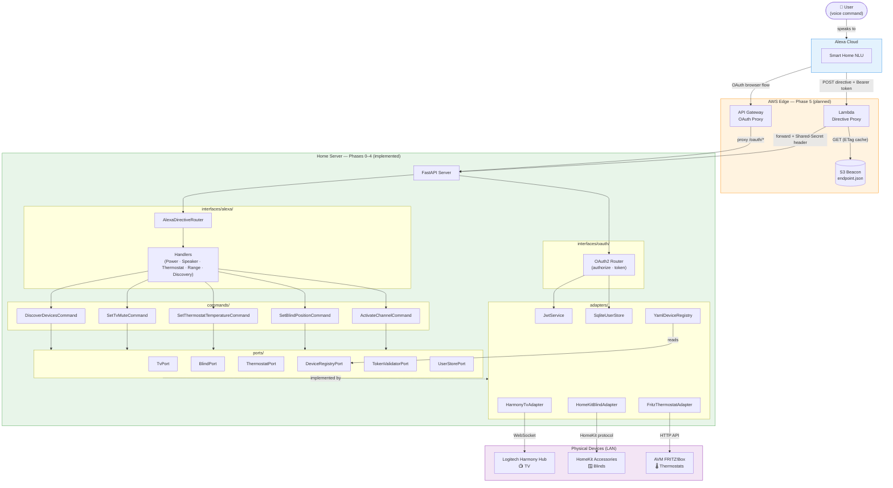
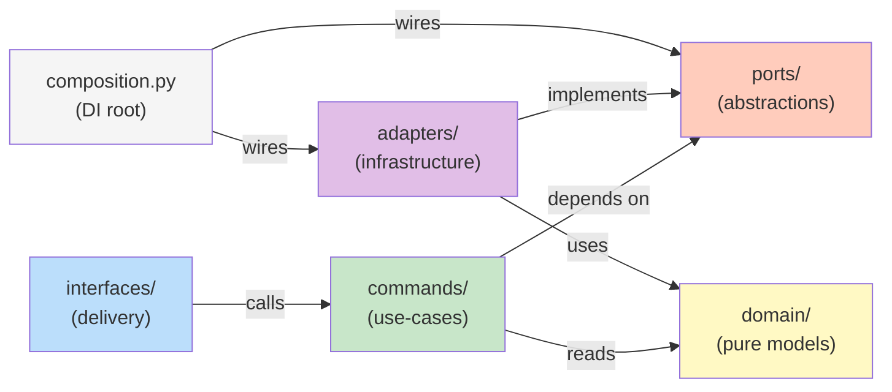
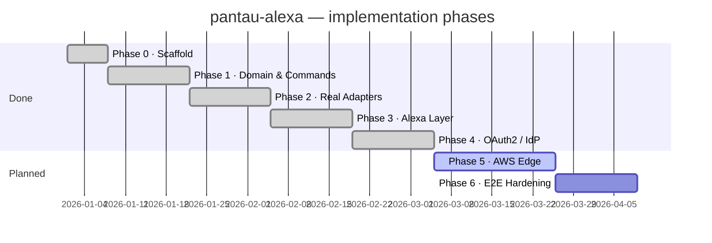

# System Overview

pantau-alexa has two distinct runtime zones — **AWS Edge** (stable, public, planned in Phase 5) and the **Home Server** (dynamic IP, your LAN, implemented in Phases 0–4). Between them sits an S3 object that tells the Lambda where to find your home server right now.

## The big picture

## Zone responsibilities

### Alexa Cloud
Amazon's servers. They receive your voice command, determine the intent (e.g. "turn on ZDF"), and call your Lambda with a structured directive JSON payload. This zone is entirely outside your control.

### AWS Edge *(Phase 5, planned)*

| Component | Role |
|---|---|
| **Lambda: Directive Proxy** | The Alexa Skill's endpoint ARN. Reads current home server URL from S3, then forwards the directive. |
| **S3: endpoint.json** | The *beacon* — a small JSON file `{ "base_url": "...", "updated_at": "..." }` that the home server keeps updated via `BeaconPublisherPort`. |
| **API Gateway: OAuth Proxy** | Stable HTTPS URLs for Alexa Account Linking. Transparently proxies `/oauth/authorize` and `/oauth/token` to the home server. |

### Home Server *(Phases 0–4, implemented)*

This is where everything interesting happens. The server exposes three routes:

| Route | Purpose |
|---|---|
| `POST /alexa/directive` | Receives Smart Home directives; validates JWT; routes to handlers |
| `GET/POST /oauth/authorize` | Shows login form; validates credentials; issues auth code |
| `POST /oauth/token` | Exchanges auth code → JWT + refresh token; or rotates refresh token |
| `GET /health` | Returns server status and device counts |

### Physical Devices (LAN)

The three device libraries run directly inside the home server process. They need LAN access — this is exactly why the device control logic cannot run inside Lambda.

| Device | Library | Protocol |
|---|---|---|
| Logitech Harmony Hub | harmonyhub-py | WebSocket (persistent connection) |
| HomeKit Accessories | homekit-py | Apple HomeKit over LAN |
| FRITZ!Box thermostats | fritzctl-py | FRITZ!Box HTTP API |

## Dependency flow

The **golden rule**: imports only flow *inward* (toward the domain). Adapters know about the domain; the domain knows nothing about adapters. Use-cases know about ports; ports know nothing about adapters. The composition root is the only place that breaks this rule — intentionally.

## Phase roadmap

