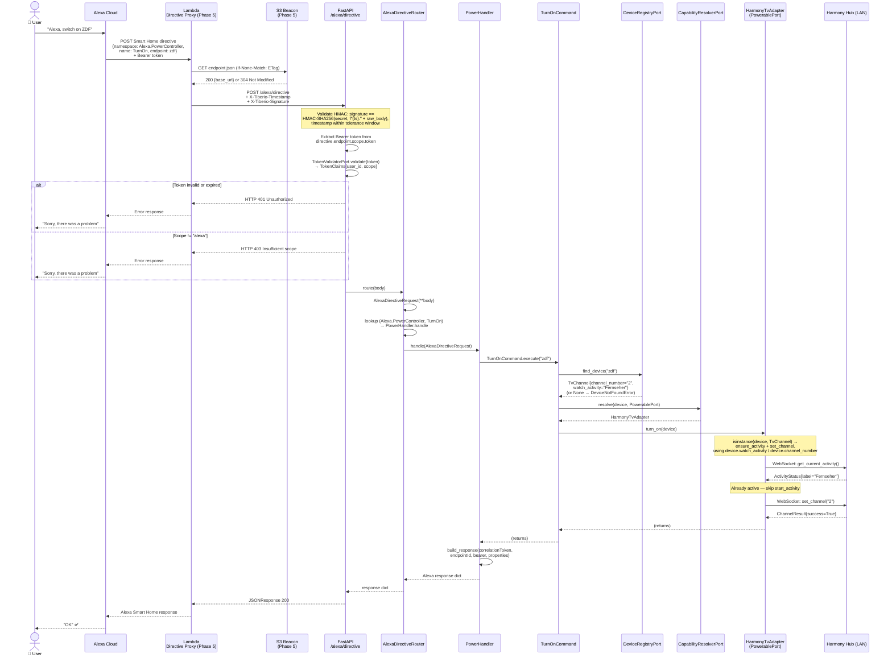
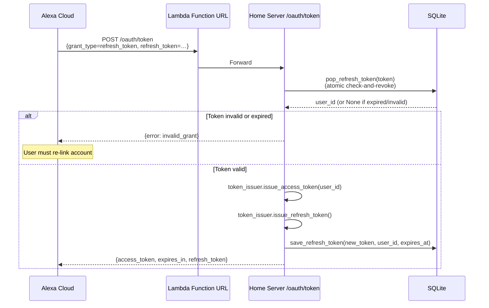

# Message Flows

This page traces the two critical request paths through the system step by step. Read these carefully — they show exactly what every module does and why it exists.

## Flow A — Account Linking (OAuth2)

Account Linking happens once, when a user enables the Alexa Skill for the first time. The goal: exchange a username/password for a pair of JWT tokens that Alexa will attach to every future directive.

::: info Phase status
The OAuth2 server on the home server (right half of the diagram) is **fully implemented** (Phase 4). The OAuth proxy (left half) runs on a **Lambda Function URL** (Phase 5). During development you can test OAuth directly at `http://localhost:8080/oauth/...`.
:::

```mermaid
sequenceDiagram
    actor User as 👤 User
    participant App as Alexa App
    participant Alexa as Alexa Cloud
    participant APIGW as Lambda Function URL<br/>(OAuth Proxy)
    participant HS as Home Server<br/>/oauth
    participant DB as SQLite<br/>(users + tokens)

    User->>App: Enable Tiberio skill
    App->>Alexa: Initiate Account Linking
    Alexa->>APIGW: GET /oauth/authorize?<br/>client_id=&redirect_uri=&<br/>code_challenge=&code_challenge_method=S256&state=
    APIGW->>HS: Forward
    HS->>HS: Validate redirect_uri against allowlist
    HS-->>User: Render HTML login form

    User->>HS: POST username + password (+ rate-limit check)
    HS->>DB: get_user_by_username(username)
    DB-->>HS: UserRecord {id, password_hash} (or None)
    HS->>HS: PasswordHasherPort.verify_password<br/>(in thread executor; dummy hash for<br/>unknown users to keep timing constant)

    alt Invalid credentials
        HS-->>User: Re-render form, HTTP 401
    else Valid credentials
        HS->>DB: auth_codes.save(user_id=…, client_id=…,<br/>redirect_uri=…, code_challenge=…,<br/>code_challenge_method=…)
        DB-->>HS: code (opaque string)
        HS-->>Alexa: 302 redirect → ?code=…&state=…
    end

    Alexa->>APIGW: POST /oauth/token<br/>{grant_type=authorization_code,<br/>code, code_verifier, redirect_uri, client_id}
    APIGW->>HS: Forward
    HS->>DB: auth_codes.lookup(code)
    DB-->>HS: AuthCodeEntry {redirect_uri, client_id,<br/>code_challenge, code_challenge_method, …}
    HS->>HS: Validate redirect_uri & client_id match entry
    HS->>HS: Verify PKCE:<br/>SHA-256(code_verifier) == code_challenge
    HS->>DB: auth_codes.redeem(code) (consume last)
    HS->>HS: token_issuer.issue_access_token(user_id)<br/>→ (access_token, expires_in)
    HS->>HS: token_issuer.issue_refresh_token()
    HS->>DB: save_refresh_token(token, user_id, expires_at)
    HS-->>Alexa: {access_token, token_type=Bearer,<br/>expires_in, refresh_token}

    Note over Alexa,HS: Account Linking complete.<br/>Alexa now has a valid Bearer token.

    Alexa->>HS: POST /alexa/directive<br/>Alexa.Discovery + Bearer token
    HS-->>Alexa: Discovery response (all devices)
    Alexa-->>User: "I found N new devices"
```

### Key security mechanisms

| Mechanism | What it does |
|---|---|
| **PKCE (S256)** | Alexa sends a `code_challenge` (SHA-256 hash of `code_verifier`) during authorize. At token exchange it sends the raw `code_verifier`. The server recomputes the hash and compares — ensures only the original caller can exchange the code. |
| **Claims validated before consume** | At token exchange the `redirect_uri` and `client_id` are checked against the stored entry, then PKCE is verified, and only then is `auth_codes.redeem(code)` called. A bad `redirect_uri`/`client_id` therefore cannot consume the code and lock out the legitimate client. |
| **Auth code is single-use** | `auth_codes.redeem()` atomically consumes the entry. A replayed code returns `invalid_grant`. |
| **Refresh token rotation** | On every `/oauth/token?grant_type=refresh_token`, the old token is atomically consumed (`pop_refresh_token`) before the new pair is issued. |
| **bcrypt (via `PasswordHasherPort`)** | Passwords are never stored in plain text — only the hash. Verification runs in a thread executor (bcrypt is CPU-bound) and checks unknown users against a dummy hash so response timing does not reveal whether a username exists. |
| **Rate limiting** | `POST /oauth/authorize` is throttled per-IP and per-IP:username (HTTP 429); `POST /oauth/token` is throttled per-IP. |
| **JWT expiry** | Access tokens expire after 60 minutes (configurable via `JwtService`). Alexa uses the refresh token to get new ones automatically. |

---

## Flow B — Voice Command

This is the hot path — everything that happens between "Alexa, switch to ZDF" and the TV changing channel.

::: info Phase status
The home server portion (FastAPI → Router → Handler → Command → Adapter → Device) is **fully implemented** (Phase 3 + 2). The Lambda proxy + S3 beacon (the top section) is **planned** (Phase 5). During development, POST directly to `http://localhost:8080/alexa/directive`.
:::



### What each layer does in this flow

| Layer | Responsibility in this flow |
|---|---|
| **Lambda** | Looks up current home server URL (S3 beacon); signs the request with `X-Tiberio-Timestamp` + `X-Tiberio-Signature`; forwards raw directive |
| **FastAPI route** | Validates the HMAC signature (when a shared secret is configured); extracts and validates the Bearer JWT via `TokenValidatorPort` (401 if invalid); enforces `scope == "alexa"` (403 if not) |
| **AlexaDirectiveRouter** | Parses the Alexa JSON into a typed model; dispatches to the correct handler by `(namespace, name)` |
| **PowerHandler** | Extracts endpoint ID and correlation token; calls `TurnOnCommand`/`TurnOffCommand`; builds the Alexa response |
| **TurnOnCommand / TurnOffCommand** | Resolve the device and its `PowerablePort` adapter via `_find_and_resolve(endpoint_id, PowerablePort)`, then call `adapter.turn_on(device)` / `adapter.turn_off(device)`; raise `DeviceNotFoundError` when the endpoint is unknown |
| **DeviceRegistryPort** | `find_device(endpoint_id)` returns the `Device` (e.g. a `TvChannel`) or `None`; the command raises `DeviceNotFoundError(endpoint_id)` on `None` |
| **HarmonyTvAdapter** (`PowerablePort`) | `turn_on(device)`: when `isinstance(device, TvChannel)` it runs `ensure_activity(device.watch_activity)` then `set_channel(device.channel_number)`; otherwise a no-op. WebSocket calls to the Harmony Hub map Hub exceptions to `DeviceUnavailableError` |

### Error handling

Every handler wraps the command call in a try/except block and maps domain errors to Alexa error responses:

| Exception | Alexa error type | Alexa behavior |
|---|---|---|
| `DeviceNotFoundError` | `NO_SUCH_ENDPOINT` | "That device is not available" |
| `DeviceUnavailableError` | `ENDPOINT_UNREACHABLE` | "That device is not responding" |
| `ValueError` | `VALUE_OUT_OF_RANGE` | "That value is out of range" |
| Any other exception | `INTERNAL_ERROR` | "Sorry, something went wrong" |

---

## Flow C — Token Refresh

Alexa automatically refreshes the access token when it expires (every 60 minutes). The refresh token rotates on each use.



Refresh token rotation means a stolen refresh token can only be used once. The atomic `pop_refresh_token` (single check-and-revoke) also guarantees that two concurrent refresh requests with the same token cannot both succeed — the legitimate user's next refresh will fail, alerting them to the compromise.
