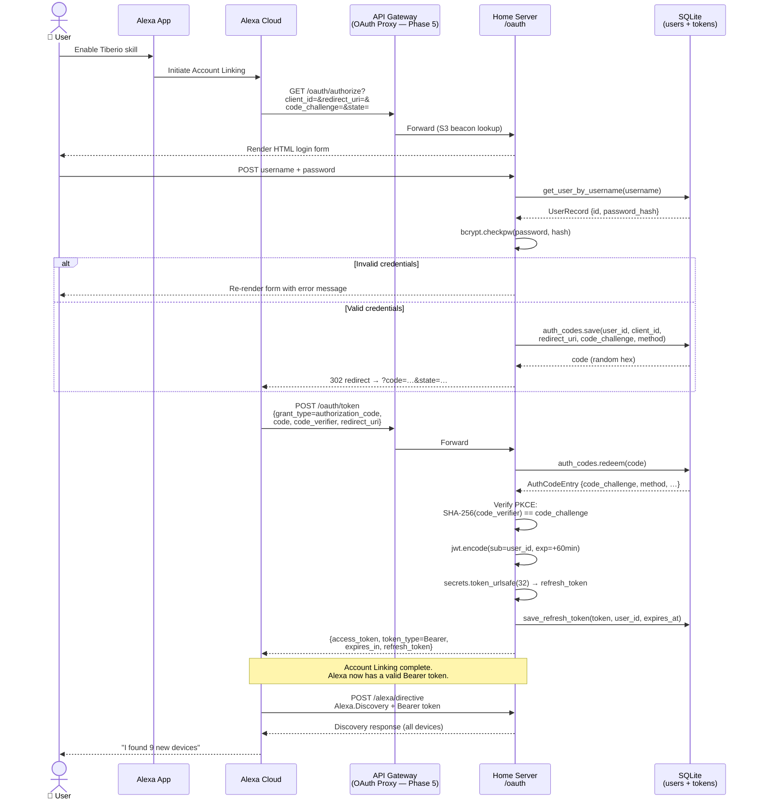
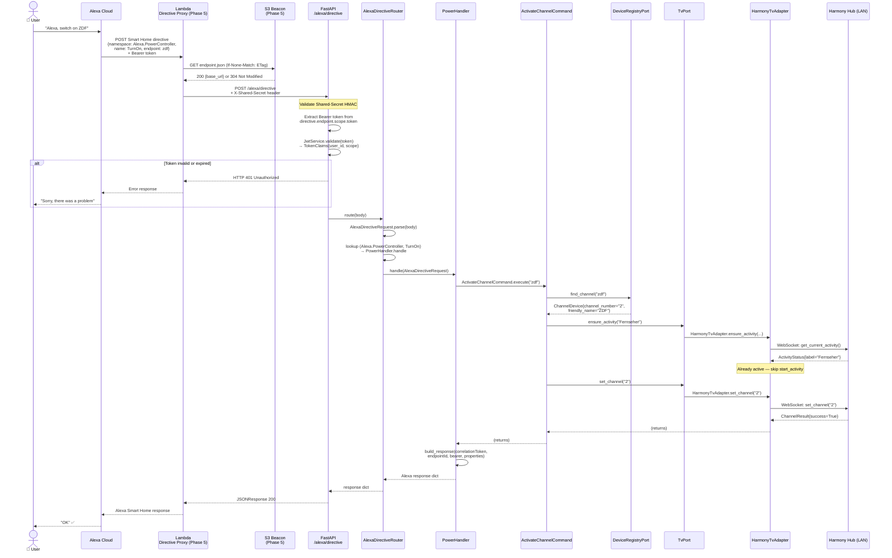
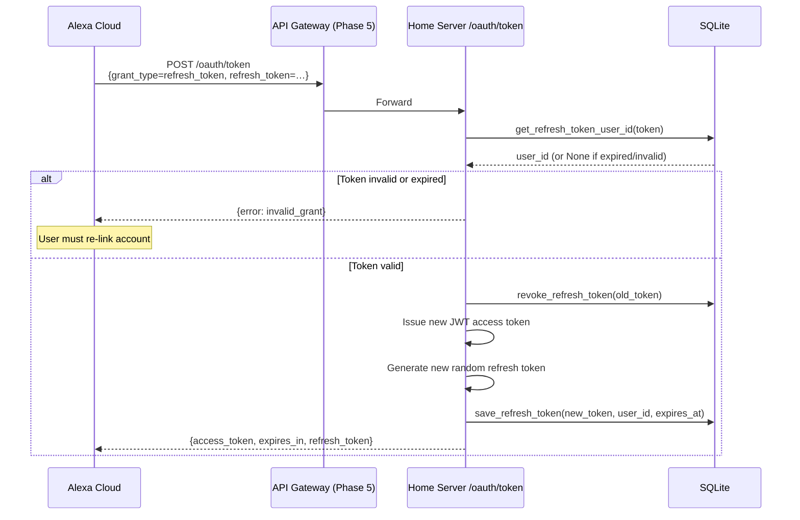

# Message Flows

This page traces the two critical request paths through the system step by step. Read these carefully — they show exactly what every module does and why it exists.

## Flow A — Account Linking (OAuth2)

Account Linking happens once, when a user enables the Alexa Skill for the first time. The goal: exchange a username/password for a pair of JWT tokens that Alexa will attach to every future directive.

::: info Phase status
The OAuth2 server on the home server (right half of the diagram) is **fully implemented** (Phase 4). The API Gateway proxy (left half) is **planned** (Phase 5). During development you can test OAuth directly at `http://localhost:8080/oauth/...`.
:::

### Key security mechanisms

| Mechanism | What it does |
|---|---|
| **PKCE (S256)** | Alexa sends a `code_challenge` (SHA-256 hash of `code_verifier`) during authorize. At token exchange it sends the raw `code_verifier`. The server recomputes the hash and compares — ensures only the original caller can exchange the code. |
| **Auth code is single-use** | `auth_codes.redeem()` atomically deletes the entry. A replayed code returns `invalid_grant`. |
| **Refresh token rotation** | On every `/oauth/token?grant_type=refresh_token`, the old token is revoked before the new pair is issued. |
| **bcrypt** | Passwords are never stored in plain text. Only the bcrypt hash is stored in SQLite. |
| **JWT expiry** | Access tokens expire after 60 minutes (configurable). Alexa uses the refresh token to get new ones automatically. |

---

## Flow B — Voice Command

This is the hot path — everything that happens between "Alexa, switch to ZDF" and the TV changing channel.

::: info Phase status
The home server portion (FastAPI → Router → Handler → Command → Adapter → Device) is **fully implemented** (Phase 3 + 2). The Lambda proxy + S3 beacon (the top section) is **planned** (Phase 5). During development, POST directly to `http://localhost:8080/alexa/directive`.
:::

### What each layer does in this flow

| Layer | Responsibility in this flow |
|---|---|
| **Lambda** | Looks up current home server URL; adds Shared-Secret header; forwards raw directive |
| **FastAPI route** | Extracts and validates the Bearer JWT; rejects with 401 if invalid |
| **AlexaDirectiveRouter** | Parses the Alexa JSON into a typed model; dispatches to the correct handler by `(namespace, name)` |
| **PowerHandler** | Extracts endpoint ID and correlation token; calls the command; builds the Alexa response |
| **ActivateChannelCommand** | Orchestrates the two-step TV activation (ensure activity → set channel); raises `DeviceNotFoundError` or `DeviceUnavailableError` |
| **DeviceRegistryPort** | Looks up the `ChannelDevice` by ID; returns `None` if not found |
| **TvPort / HarmonyTvAdapter** | WebSocket calls to the Harmony Hub; maps Hub exceptions to `DeviceUnavailableError` |

### Error handling

Every handler wraps the command call in a try/except block and maps domain errors to Alexa error responses:

| Exception | Alexa error type | Alexa behavior |
|---|---|---|
| `DeviceNotFoundError` | `NO_SUCH_ENDPOINT` | "That device is not available" |
| `DeviceUnavailableError` | `ENDPOINT_UNREACHABLE` | "That device is not responding" |
| `ValueError` | `VALUE_OUT_OF_RANGE` | "That value is out of range" |
| Any other exception | `INTERNAL_ERROR` | "Sorry, something went wrong" |

---

## Flow C — Token Refresh

Alexa automatically refreshes the access token when it expires (every 60 minutes). The refresh token rotates on each use.

Refresh token rotation means a stolen refresh token can only be used once — the legitimate user's next refresh will fail, alerting them to the compromise.
