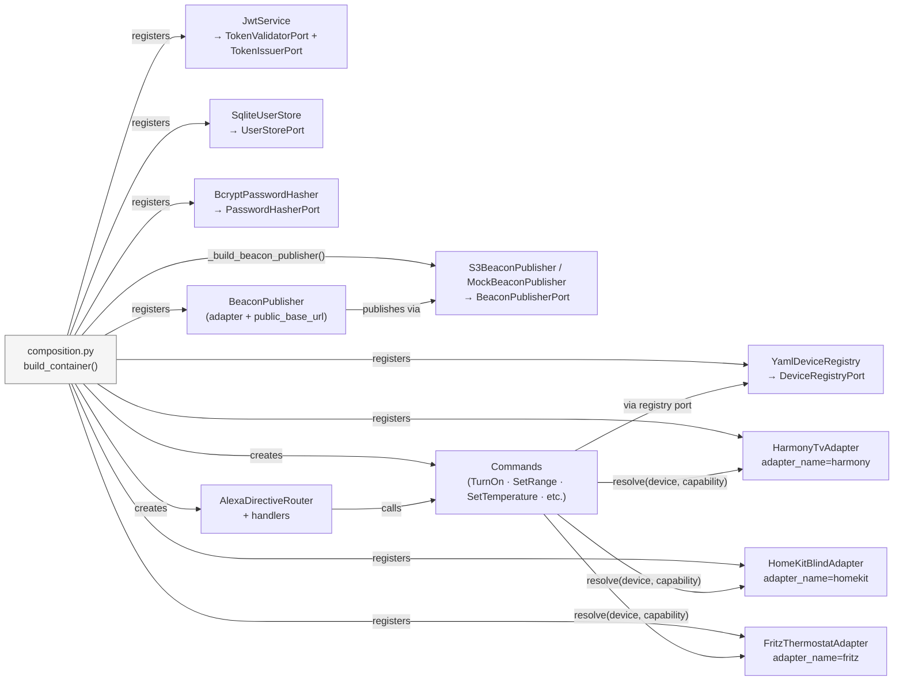

# composition.py

**Location:** `tiberio/composition.py`
**Role:** The only file that knows both ports *and* adapters. It wires them together at startup.

`composition.py` is the **Composition Root** — the single place where the application's object graph is assembled. This is where "dependency injection" actually happens: adapters are created and registered against their port types, then injected into commands and handlers.

## Why a Composition Root?

Without a composition root, wiring logic leaks everywhere: handlers create their own adapters, use-cases import concrete classes, tests have to monkey-patch production code. A single composition root means:

- **One place to change** when swapping a real adapter for a test double.
- **No circular imports** — the domain and commands never import adapters.
- **Testability by construction** — `build_test_container()` produces a fully wired application with mock adapters in one line.

## The Container

A type-keyed registry that maps port types to adapter instances, plus an `adapter_name` index for device-centric capability resolution:

```python
class Container:
    def register(
        self, port: type[T], adapter: T, *, adapter_name: str | None = None
    ) -> Container:
        """Register adapter under port. Returns self for chaining.

        Pass adapter_name (e.g. "harmony") to also make the adapter
        retrievable via resolve()."""

    def get(self, port: type[T]) -> T:
        """Return the adapter for port. Raises KeyError if not registered."""

    def resolve(self, device: Device, capability: type[T]) -> T:
        """Return the adapter for device.adapter implementing capability."""

    def all_implementing(self, capability: type[T]) -> list[T]:
        """All distinct registered adapters that implement capability."""

    @property
    def lifecycle_adapters(self) -> list[Lifecycle]:
        """All registered adapters that implement start()/stop()."""

    def _unique_instances(
        self, source: Iterable[object], capability: type[T]
    ) -> list[T]:
        """Filter source to distinct instances implementing capability.

        Shared by all_implementing and lifecycle_adapters — dedup is
        by object identity, in iteration order."""
```

The key is the **type** (the port class itself), not a string. This means the IDE and mypy can type-check `container.get(DeviceRegistryPort)` — you get autocomplete on the result.

### Device-centric resolution

`resolve(device, capability)` looks up the adapter registered under the device's `adapter` name (`harmony`, `homekit`, `fritz`) and verifies via `isinstance` that it implements the requested capability port. It raises **domain errors**, not generic ones, so handlers can map them to proper Alexa error types instead of `INTERNAL_ERROR`:

- `DeviceUnavailableError` — no adapter registered for the device's adapter name
- `DeviceCapabilityError` — the adapter does not implement the requested capability

The `Container` itself satisfies `CapabilityResolverPort` structurally and is passed to the commands as their resolver.

---

## build_container() — Production

Builds the full application with all real adapters:

```python
def build_container(settings: Settings) -> Container:
    registry = YamlDeviceRegistry(settings.devices_config_path)

    harmony = HarmonyTvAdapter()
    homekit = HomeKitBlindAdapter()
    fritz = FritzThermostatAdapter()
    jwt_service = JwtService(
        settings.jwt_secret.get_secret_value(),
        algorithm=settings.jwt_algorithm,
        access_token_expire_minutes=settings.jwt_access_token_expire_minutes,
    )
    user_store = SqliteUserStore(settings.users_db_path)
    auth_codes = AuthCodeStore()
    beacon_publisher = _build_beacon_publisher(settings)
    publish_beacon = BeaconPublisher(beacon_publisher, settings.public_base_url)

    container = (
        Container()
        .register(DeviceRegistryPort, registry)
        .register(HarmonyTvAdapter, harmony, adapter_name=ADAPTER_HARMONY)
        .register(HomeKitBlindAdapter, homekit, adapter_name=ADAPTER_HOMEKIT)
        .register(FritzThermostatAdapter, fritz, adapter_name=ADAPTER_FRITZ)
        .register(TokenValidatorPort, jwt_service)
        .register(TokenIssuerPort, jwt_service)
        .register(UserStorePort, user_store)
        .register(AuthCodeStorePort, auth_codes)
        .register(PasswordHasherPort, BcryptPasswordHasher())
        .register(BeaconPublisherPort, beacon_publisher)
        .register(BeaconPublisher, publish_beacon)
    )

    _wire_commands_and_router(container)
    return container
```

Note that `JwtService` is constructed from individual values (`secret`, `algorithm`, `access_token_expire_minutes`) — it has no dependency on the `Settings` object. The same instance is registered *twice*: under `TokenValidatorPort` (for directive validation) and under `TokenIssuerPort` (for the OAuth token endpoint).

The device adapters are registered under their concrete types with an `adapter_name` slot (`ADAPTER_HARMONY`, `ADAPTER_HOMEKIT`, `ADAPTER_FRITZ` from `domain/models.py`) — capability resolution happens per device through `resolve()`, not through capability-port keys.

The beacon subsystem follows the same individual-values pattern: the chosen adapter is registered under `BeaconPublisherPort`, while the `BeaconPublisher` application service is constructed from that adapter plus `settings.public_base_url` and registered under its own type. Which adapter sits behind the port is decided by the `_build_beacon_publisher()` helper (below).

---

## _build_beacon_publisher()

Selects the beacon-publisher adapter from settings. `beacon_enabled` is the single active/inactive predicate: when set, an `S3BeaconPublisher` is built from `settings.s3_beacon_bucket`, `settings.s3_beacon_key` and `settings.aws_region`; otherwise a `MockBeaconPublisher` is returned. App startup validation guarantees `public_base_url` is set whenever the beacon is enabled.

```python
def _build_beacon_publisher(settings: Settings) -> BeaconPublisherPort:
    if settings.beacon_enabled:
        return S3BeaconPublisher(
            bucket=settings.s3_beacon_bucket,
            key=settings.s3_beacon_key,
            region=settings.aws_region,
        )
    return MockBeaconPublisher()
```

---

## _wire_commands_and_router()

Creates all commands as singletons and wires the Alexa directive router. Every device command receives the registry port and the container itself (as `CapabilityResolverPort`):

```python
def _wire_commands_and_router(container: Container) -> None:
    registry_port = container.get(DeviceRegistryPort)

    # Commands (singletons) — registry + container-as-resolver
    turn_on = TurnOnCommand(registry_port, container)
    turn_off = TurnOffCommand(registry_port, container)
    set_mute = SetMuteCommand(registry_port, container)
    set_volume = SetVolumeCommand(registry_port, container)
    adjust_volume = AdjustVolumeCommand(registry_port, container)
    get_speaker_state = GetSpeakerStateCommand(registry_port, container)
    set_range = SetRangeCommand(registry_port, container)
    adjust_range = AdjustRangeCommand(registry_port, container)
    set_temperature = SetTemperatureCommand(registry_port, container)
    adjust_temperature = AdjustTemperatureCommand(
        registry_port, container, set_temperature
    )
    discover = DiscoverDevicesCommand(registry_port)
    list_connected = ListConnectedDevicesCommand(container)

    # Register commands in container
    container.register(TurnOnCommand, turn_on)
    # ... etc.

    # Create handlers, passing the commands they need
    power_handler = PowerHandler(turn_on, turn_off)
    speaker_handler = SpeakerHandler(
        set_mute, set_volume, adjust_volume, get_speaker_state
    )
    thermostat_handler = ThermostatHandler(set_temperature, adjust_temperature)
    range_handler = RangeHandler(set_range, adjust_range)
    discovery_handler = DiscoveryHandler(discover)

    # Wire the Alexa directive router
    alexa_router = AlexaDirectiveRouter(
        power=power_handler,
        speaker=speaker_handler,
        thermostat=thermostat_handler,
        range_=range_handler,
        discovery=discovery_handler,
    )
    container.register(AlexaDirectiveRouter, alexa_router)
```

`AdjustTemperatureCommand` additionally receives `SetTemperatureCommand`, to which it delegates after computing the new setpoint.

---

## build_test_container() — Integration tests

Same wiring, but the device adapters are replaced with mocks. The mocks are registered under the **same adapter names**, so `resolve()` works identically:

```python
def build_test_container(devices_config_path: Path) -> Container:
    registry = YamlDeviceRegistry(devices_config_path)
    mock_beacon = MockBeaconPublisher()

    container = (
        Container()
        .register(DeviceRegistryPort, registry)
        .register(MockTvAdapter, MockTvAdapter(), adapter_name=ADAPTER_HARMONY)
        .register(MockBlindAdapter, MockBlindAdapter(), adapter_name=ADAPTER_HOMEKIT)
        .register(MockThermostatAdapter, MockThermostatAdapter(), adapter_name=ADAPTER_FRITZ)
        .register(TokenValidatorPort, MockTokenValidator())
        .register(BeaconPublisherPort, mock_beacon)
        .register(BeaconPublisher, BeaconPublisher(mock_beacon, ""))
    )
    _wire_commands_and_router(container)
    return container
```

The beacon subsystem is mocked too: a `MockBeaconPublisher` is registered under `BeaconPublisherPort`, and the `BeaconPublisher` service is constructed against it with an empty base URL (no beacons are published in tests).

`_wire_commands_and_router()` is shared — commands and handlers are wired identically in both production and test. The only difference is which adapter sits behind each adapter name.

---

## build_oauth_test_container() — OAuth integration tests

Extends `build_test_container()` with a real `JwtService`, an in-memory SQLite store, a real auth-code store and the bcrypt hasher, so OAuth flows can be tested end-to-end without real devices:

```python
def build_oauth_test_container(
    devices_config_path: Path,
    user_store: SqliteUserStore,
    jwt_service: JwtService,
    auth_codes: AuthCodeStore,
) -> Container:
    container = build_test_container(devices_config_path)
    # Override TokenValidatorPort with the real JwtService for OAuth tests
    container.register(TokenValidatorPort, jwt_service)
    container.register(TokenIssuerPort, jwt_service)
    container.register(UserStorePort, user_store)
    container.register(AuthCodeStorePort, auth_codes)
    container.register(PasswordHasherPort, BcryptPasswordHasher())
    return container
```

---

## The Lifecycle protocol

Adapters that own a persistent connection implement:

```python
@runtime_checkable
class Lifecycle(Protocol):
    async def start(self) -> None: ...
    async def stop(self) -> None: ...
```

`container.lifecycle_adapters` returns all registered adapters that satisfy this protocol (deduped by instance, in registration order). The FastAPI lifespan calls them in registration order on startup and in reverse order on shutdown.

**Current lifecycle adapters:**
- `HarmonyTvAdapter`, `HomeKitBlindAdapter`, `FritzThermostatAdapter` — open/close their backend connections
- `SqliteUserStore` — opens/closes the SQLite connection and creates tables

---

## Full wiring diagram


