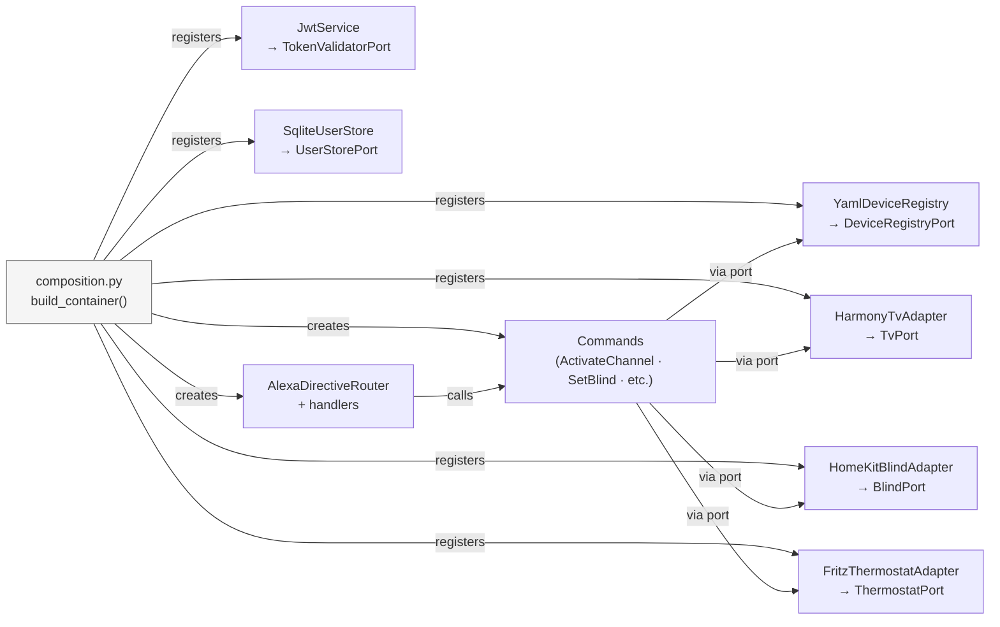

# composition.py

**Location:** `pantau/composition.py`  
**Role:** The only file that knows both ports *and* adapters. It wires them together at startup.

`composition.py` is the **Composition Root** — the single place where the application's object graph is assembled. This is where "dependency injection" actually happens: adapters are created and registered against their port types, then injected into commands and handlers.

## Why a Composition Root?

Without a composition root, wiring logic leaks everywhere: handlers create their own adapters, use-cases import concrete classes, tests have to monkey-patch production code. A single composition root means:

- **One place to change** when swapping a real adapter for a test double.
- **No circular imports** — the domain and commands never import adapters.
- **Testability by construction** — `build_test_container()` produces a fully wired application with mock adapters in one line.

## The Container

A type-keyed dictionary that maps port types to their adapter instances:

```python
class Container:
    def register(self, port: type[T], adapter: T) -> Container:
        """Register adapter under port. Returns self for chaining."""
        self._store[port] = adapter
        self._order.append(port)
        return self

    def get(self, port: type[T]) -> T:
        """Return the adapter for port. Raises KeyError if not registered."""
        return cast(T, self._store[port])

    @property
    def lifecycle_adapters(self) -> list[Lifecycle]:
        """All registered adapters that implement start()/stop()."""
```

The key is the **type** (the port class itself), not a string. This means the IDE and mypy can type-check `container.get(TvPort)` — you get autocomplete on the result.

---

## build_container() — Production

Builds the full application with all real adapters:

```python
def build_container(settings: Settings) -> Container:
    registry = YamlDeviceRegistry(settings.devices_config_path)
    jwt_service = JwtService(settings)
    user_store = SqliteUserStore(settings.users_db_path)
    auth_codes = AuthCodeStore()

    container = (
        Container()
        .register(DeviceRegistryPort, registry)
        .register(TvPort,            HarmonyTvAdapter(harmony_host))
        .register(BlindPort,         HomeKitBlindAdapter())
        .register(ThermostatPort,    FritzThermostatAdapter())
        .register(TokenValidatorPort, jwt_service)
        .register(JwtService,        jwt_service)
        .register(UserStorePort,     user_store)
        .register(AuthCodeStore,     auth_codes)
    )

    _wire_commands_and_router(container)
    return container
```

Note that `JwtService` is registered *twice*: once under `TokenValidatorPort` (for directive validation) and once under `JwtService` directly (for the OAuth token endpoint, which needs to call `issue_access_token()`).

---

## _wire_commands_and_router()

Creates all commands as singletons and wires the Alexa directive router:

```python
def _wire_commands_and_router(container: Container) -> None:
    # Retrieve ports (not adapters — the command layer never sees adapters)
    registry_port = container.get(DeviceRegistryPort)
    tv_port       = container.get(TvPort)
    blind_port    = container.get(BlindPort)
    thermostat_port = container.get(ThermostatPort)

    # Create commands (singletons — SetTvMuteCommand holds assumed mute state)
    activate_channel = ActivateChannelCommand(registry_port, tv_port)
    set_mute         = SetTvMuteCommand(registry_port, tv_port)
    set_temperature  = SetThermostatTemperatureCommand(registry_port, thermostat_port)
    set_blind        = SetBlindPositionCommand(registry_port, blind_port)
    adjust_blind     = AdjustBlindPositionCommand(registry_port, blind_port)
    discover         = DiscoverDevicesCommand(registry_port)

    # Register commands in container
    container.register(ActivateChannelCommand, activate_channel)
    # ... etc.

    # Create handlers, passing the commands they need
    power_handler    = PowerHandler(activate_channel)
    speaker_handler  = SpeakerHandler(set_mute)
    thermostat_handler = ThermostatHandler(set_temperature)
    range_handler    = RangeHandler(set_blind, adjust_blind)
    discovery_handler = DiscoveryHandler(discover)

    # Wire the Alexa directive router
    alexa_router = AlexaDirectiveRouter(
        power=power_handler,
        speaker=speaker_handler,
        thermostat=thermostat_handler,
        range_=range_handler,
        discovery=discovery_handler,
    )
    container.register(AlexaDirectiveRouter, alexa_router)
```

---

## build_test_container() — Integration tests

Same wiring, but all device adapters are replaced with mocks:

```python
def build_test_container(devices_config_path: Path) -> Container:
    container = (
        Container()
        .register(DeviceRegistryPort, YamlDeviceRegistry(devices_config_path))
        .register(TvPort,            MockTvAdapter())
        .register(BlindPort,         MockBlindAdapter())
        .register(ThermostatPort,    MockThermostatAdapter())
        .register(TokenValidatorPort, MockTokenValidator())
    )
    _wire_commands_and_router(container)
    return container
```

`_wire_commands_and_router()` is shared — commands and handlers are wired identically in both production and test. The only difference is which adapter sits behind the port.

---

## build_oauth_test_container() — OAuth integration tests

Extends `build_test_container()` with a real `JwtService` and an in-memory SQLite store, so OAuth flows can be tested end-to-end without real devices:

```python
def build_oauth_test_container(
    devices_config_path: Path,
    user_store: SqliteUserStore,
    jwt_service: JwtService,
    auth_codes: AuthCodeStore,
) -> Container:
    container = build_test_container(devices_config_path)
    container.register(JwtService,        jwt_service)
    container.register(TokenValidatorPort, jwt_service)
    container.register(UserStorePort,     user_store)
    container.register(AuthCodeStore,     auth_codes)
    return container
```

---

## The Lifecycle protocol

Adapters that own a persistent connection implement:

```python
@runtime_checkable
class Lifecycle(Protocol):
    async def start(self) -> None: ...
    async def stop(self) -> None: ...
```

`container.lifecycle_adapters` returns all registered adapters that satisfy this protocol. The FastAPI lifespan calls them in registration order on startup and in reverse order on shutdown.

**Current lifecycle adapters:**
- `HarmonyTvAdapter` — opens/closes the Harmony Hub WebSocket
- `SqliteUserStore` — opens/closes the SQLite connection and creates tables

---

## Full wiring diagram


